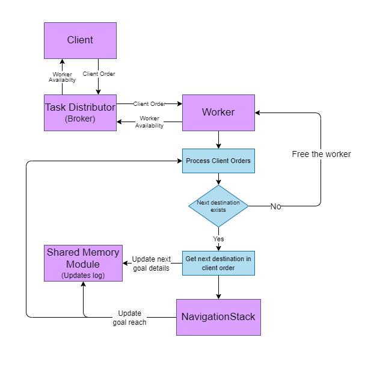
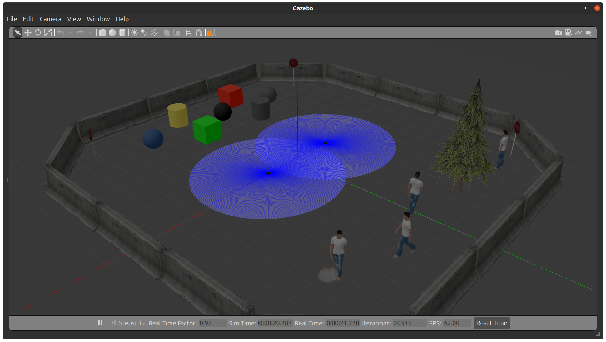
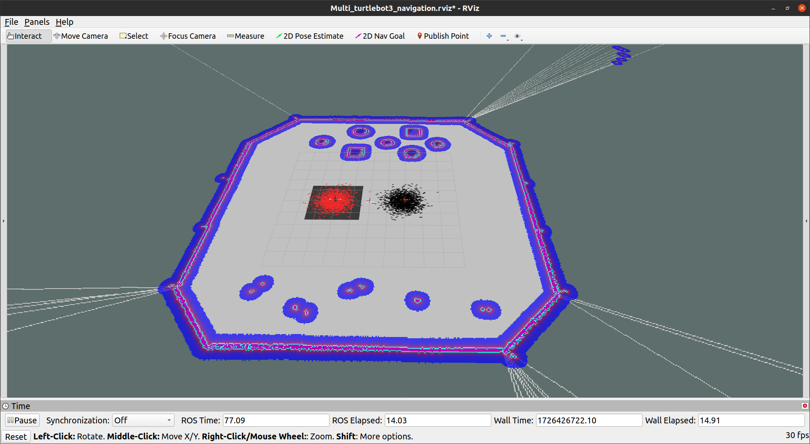

# ss24-multi-robot-task-distribution

# Multi-Robot Task Distributions

## Description

The multi-robot task distribution project aims to develop a scalable and efficient system for distributing tasks among a fleet of autonomous robots in various environments. The aim for the robots is to collaborate and fulfills the tasks which is picking up parcels from multiple locations and collectiong it into one place.(In this project dummy parcles are used instead on real pick and drop but the implementation will be same as in dummy setup used)

The project seeks to optimize task allocation, minimize response times, and enhance overall mission performance.

## Features

1. The system will be capable of dynamically assigning tasks to multiple robots based on their availability, capabilities, and proximity to task locations.

2.  Robust communication protocols will enable seamless information exchange between robots and a central task distribution module, ensuring timely updates and coordination.

3. Prioritization modules will be implemented to handle  tasks, ensuring  tasks are addressed promptly.

4. Robots will employ adaptive routing strategies to optimize their paths and avoid congestion, leading to efficient task execution and resource utilization.


## Objectives
1. Using the existing robots, create a map of the environment and navigate through it (using single robots)

2. Improve robot localization by adding IMU sensor data.

3. Use Zeromq to distribute navigation tasks to robots.

4. Improve/cleanup existing robot ROS workspace

5. Implement a centralized task distribution module and interface it with the robot fleet for seamless communication and coordination.

## Scope 

1. The project will focus on developing software solutions for task distribution and coordination, assuming the availability of a fleet of autonomous robots.

2. Hardware aspects such as robot design and sensor integration will be considered within the context of software implementation requirements.

## Deliverables

* Robot Module
Navigatation of multiple robot with shared memory which fulfills the consolidation of orders in warehouse environments

    * Localisation using sensor fusion IMU,Odometry.
    * Mapping of entire environment 
    * Navigation of multi robots with shared data and communication among each other. 


* Task distribution algorithm implementation which distributes the tasks to each robot(Load balancer).
    
    * Design and implement load balancer with ZeroMQ
    * Test load balancing in task distribution

      


* Shared Memory Module logs he robot activities and manages the Inventory. It integrates with ROS to handle real-time updates and communicate with robots.

* Inventory Management
Initialization: Reads shelf and inventory details from a CSV file to set up initial inventory quantities and shelf locations.
Update: Adjusts inventory levels as robots complete tasks, ensuring the correct number of items is tracked.

* Robot Activity Logging
Initialization: Sets up a specified number of robots, each represented by a RobotState object.
Goal Start: Logs the initiation of tasks by robots, including the details of the shelf and items involved.
Goal Reach: Logs when a robot reaches its destination. Updates the inventory based on the completed task and records detailed activity in a CSV file.

* Overall Operation
Setup: Initializes the inventory and robots. Configures subscriptions to ROS topics for real-time updates on robot tasks.
Monitoring: Continuously listens for goal start and reach messages to manage tasks and update logs.
Logging: Maintains detailed logs of robot activities and inventory changes for tracking and analysis.
* Documentation covering system architecture, algorithms, and usage guidelines.

## Architecture & Flow chart 




## Tools/Software Used
 * Ubuntu 20.04
 * ROS Noetic
 * Python
 * C++
 * ZeroMq
 * Mqtt
 * Git


 # Installation and Project setup.

 * You need ROS Noetic version to use these packages.

    please install ros noetic using this link and instructions
    https://wiki.ros.org/noetic/Installation


# Running Simulation

## Prerequisites

Make sure you have the following installed on your system:
- ROS (Robot Operating System) - [Installation Guide](http://wiki.ros.org/ROS/Installation)
- Git

### 1. Create a ROS Workspace

First, create a new ROS workspace and initialize it:

```bash
mkdir -p ~/catkin_ws/src
cd ~/catkin_ws/
catkin_make

source devel/setup.bash

```
Clone the Package
Navigate to the src directory of your workspace and clone the repository:
```bash
cd ~/catkin_ws/src
git clone git@github.com:HBRS-SDP/ss24-multi-robot-task-distribution.git
```
Build the Package
After cloning the repository, go back to the root of your workspace and build it using 
```
catkin_make
```
## Run the Nodes
You can now run the nodes provided by your package. Open a new terminal, source the workspace, and use rosrun or roslaunch to start your nodes:

```bash
# Source the workspace
source ~/catkin_ws/devel/setup.bash

roslaunch turtlebot3_gazebo multi_turtlebot3_closeworld2.launch
roslaunch turtlebot3_navigation turtlebot3_navigation.launch 
```



## SM_Module
Run the ROS node for shared memory module from the shared_memory package folder. 
```
rosrun shared_memory shared_memory.py
```
## TM_Module
Run the python executable for task distributor from the scr folder.
```
cd ~/catkin_ws/src
python3 task_distributor.py
```

## Overall steps to run - for single robot

1. run each of the below commands in new terminals
```
roscore
```
```
export TURTLEBOT3_MODEL=burger
```
```
roslaunch mrtd_pkg world.launch
```
```
roslaunch mrtd_pkg warehouse.launch
```
2. got to TaskDistributor directory and run each of the below commands in new terminals
```
python3 broker.py
```
```
python3 client.py sample_orders.csv
```
3. go to shared_memory directory and run each of the below commands in new terminals
```
rosrun shared_memory shared_memory_node.py
```
```
rosrun mrtd_pkg nav2goal.py
``` 

please add the robot_id which is 0 and 1.


# Task Distribution Overview

In this multi-robot system, task distribution is handled by the broker using ZMQ. The broker ensures that tasks from the client are evenly distributed among workers (robots), based on their availability. 


ZMQ Request-Reply Architecture 


Reference:

- https://zguide.zeromq.org/docs/chapter3/
- https://zeromq.org/


## Task Distribution Workflow


### Initialization:
- The broker starts and binds two sockets:
  - **Frontend Socket (port 5555)**: To handle client requests (tasks).
  - **Backend Socket (port 5556)**: To manage communication with the workers.
- A poller is initialized to monitor both sockets for incoming messages.
- The broker maintains two lists:
  - `workers[]`: Tracks available workers (robots) that are ready to take on tasks.
  - `tasks[]`: Queues incoming tasks from the client.


### Worker Availability :
- Each worker, upon startup, sends a `READY` message to the broker. This signals the broker that the worker is available for tasks.
- The broker adds the worker to the `workers[]` list.

**Key Event**: Worker sends `READY` → Broker adds worker to the available workers list.


### Task Arrival (Client Sends a Task):
- The client submits a task to the broker via the **frontend socket**.
- The task is stored in the `tasks[]` queue until a worker becomes available.

**Key Event**: Client sends a task → Broker adds task to the task queue.


### Task Assignment:
- The broker continually monitors both the `tasks[]` queue and the `workers[]` list.
- When both a task and a worker are available, the broker assigns the task to the next available worker.
- **Task Assignment Strategy**:
  - The broker selects the first available worker from the `workers[]` list (FIFO).
  - The broker removes the worker from the available list and assigns the task.

**Key Event**: Task is available + Worker is available → Broker sends task to worker.


### Task Completion:
- Once a worker completes a task, it sends the result back to the broker.
- The broker forwards this result to the client and adds the worker back to the `workers[]` list, marking it as ready for a new task.

**Key Event**: Worker completes task → Broker receives result and marks worker as available.

### Continuous Polling:
- The broker continuously polls both the **frontend** (for tasks) and **backend** (for worker availability and task results).
- The cycle repeats, ensuring that tasks are distributed evenly among workers, and no worker is overloaded.

# Demo Video
## Links:
* https://youtu.be/UtQDjkJtfoQ 
* https://youtu.be/asg0zFYG6K0


